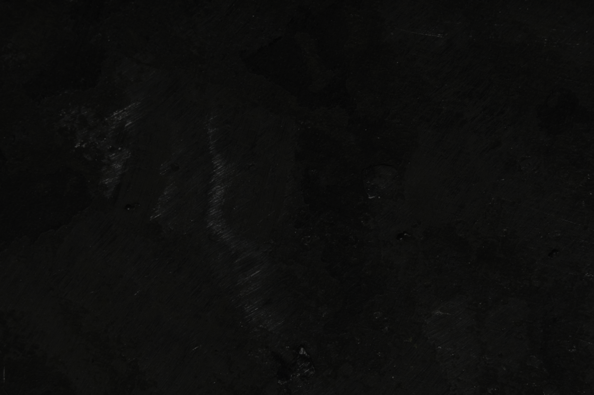

# Guilds 1
## Guilds 2
### Guilds 3
#### Guilds 4
##### Guilds 5
###### Guilds 6

---
***
___

* a 
* b
* c

>> Blockquotson

> Block1

**bold**

*italics*

1. First
2. Second
3. Thrid

`coder`

[linkerson](guilds.md)

| Syntax | Description |
| ----------- | ----------- |
| Header | Title |
| Paragraph | Text |

Here's a sentence with a footnote. [^1]

[^1]: This is the footnote.

term
: definition

~~The world is flat.~~

- [x] Write the press release
- [ ] Update the website
- [ ] Contact the media

I need to highlight these ==very important words==.

H~2~O

X^2^

<ul>
    
    
{{ g }}

    
</ul>

